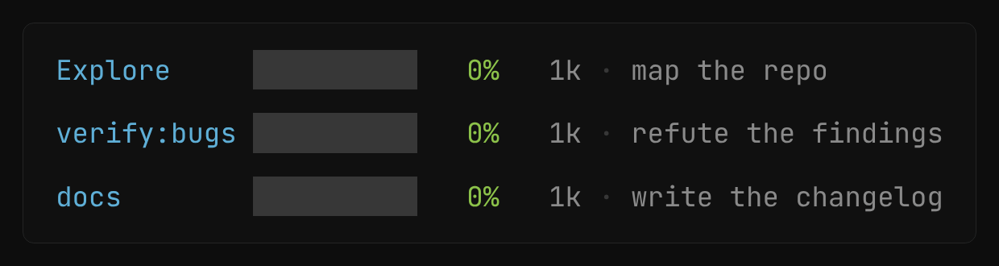

<div align="center">

# claude-statusline

## Are you spending faster than the clock?

[](https://github.com/alp82/claude-statusline)

[](https://claude.com/claude-code)
[](https://code.claude.com/docs/en/statusline.md)
[](#requirements)

<br>

One bash script. Each limit bar shows two things: how much you have used, and
how much time has passed. If usage is ahead of time, drop an effort level. If it
is behind, you can raise it. Your folder, branch, model and context window sit
on the same line, under the prompt.

<br>


**[See it in motion → alp82.github.io/claude-statusline](https://alp82.github.io/claude-statusline/)**

</div>

---

## Install

Paste this into Claude Code. Claude installs the script, updates the settings,
and checks the result.

```text
Install the statusline from https://github.com/alp82/claude-statusline for me.
Run: curl -fsSL https://alp82.github.io/claude-statusline/install.sh | bash
Then check that bash, jq and curl are present, confirm ~/.claude/settings.json
points statusLine at ~/.claude/statusline.sh and subagentStatusLine at
~/.claude/subagent-statusline.sh, and tell me what to do next.
```

Claude reads the installer before it runs it and tells you what changed. Paste
it again to upgrade.

<details>
<summary>Or run the installer yourself</summary>

<br>

The same script without the agent:

```sh
curl -fsSL https://alp82.github.io/claude-statusline/install.sh | bash
```

It puts `statusline.sh` and `subagent-statusline.sh` into `~/.claude/`, makes
them executable, and points `settings.json` at them. It copies anything it
replaces to `<file>.bak` first. Run it again to upgrade. `--no-settings`
installs the scripts only. `--help` lists all options.

</details>

<details>
<summary>Or install it by hand</summary>

<br>

Two files, nothing else:

```sh
curl -fsSL https://raw.githubusercontent.com/alp82/claude-statusline/main/statusline.sh \
  -o ~/.claude/statusline.sh
curl -fsSL https://raw.githubusercontent.com/alp82/claude-statusline/main/subagent-statusline.sh \
  -o ~/.claude/subagent-statusline.sh
chmod +x ~/.claude/statusline.sh ~/.claude/subagent-statusline.sh
```

Then add this to `~/.claude/settings.json`:

```json
{
  "statusLine": {
    "type": "command",
    "command": "~/.claude/statusline.sh"
  },
  "subagentStatusLine": {
    "type": "command",
    "command": "~/.claude/subagent-statusline.sh"
  }
}
```

</details>

## Uninstall

The same prompt in reverse:

```text
Uninstall the statusline from https://github.com/alp82/claude-statusline for me.
Run: curl -fsSL https://alp82.github.io/claude-statusline/install.sh | bash -s -- --uninstall
Then confirm ~/.claude/statusline.sh and ~/.claude/subagent-statusline.sh are gone,
confirm ~/.claude/settings.json has no statusLine or subagentStatusLine entry,
and show me which .bak files it left behind.
```

<details>
<summary>Or run it yourself</summary>

<br>

```sh
curl -fsSL https://alp82.github.io/claude-statusline/install.sh | bash -s -- --uninstall
```

It removes both scripts from `~/.claude/`, the `statusLine` and
`subagentStatusLine` entries in `settings.json`, and the cache under
`~/.claude/cache/`. It backs up the scripts and `settings.json` as `.bak`
first. It changes nothing else, and it leaves an entry alone if it points at
another statusline. `--no-settings` removes the scripts only.

</details>

## What it shows

Left to right:

- **dir ⎇ branch** — the directory name and the git branch. In a linked
  [git worktree](https://git-scm.com/docs/git-worktree) the glyph is an amber
  `⎇+`:

  ```text
  claude-statusline ⎇ main          ← the main checkout
  claude-statusline-fix ⎇+ fix/bar  ← a linked worktree
  ```
- **★ Model** — the active model's display name
- **Ctx** — how full the context window is, 0–100%, and the token count in
  thousands
- **5h / 7d** — the 5-hour and 7-day rate-limit windows: usage, elapsed time,
  and `↻` the time until the reset
- **Fable** — the same for the Fable weekly quota. It resets with the 7-day
  window, so it shows no `↻` of its own

## How to read it

### Usage against time


The top half of each bar shows usage. The bottom half shows elapsed time.

If usage is ahead of time, you run out before the window resets. Drop an effort
level to slow the spend. The loop above shows this: high effort until usage
passes the clock, then low effort, and the clock catches up again. If usage is
behind, you have quota to spare and can raise the effort.

#### Colors

The bar color compares usage with elapsed time:

- 🟩 quota to spare: raise model or effort
- 🟨 on pace: keep as is
- 🟥 runs out early: lower model or effort

The number color shows usage: 🟩 under 50% · 🟨 50–80% · 🟥 over 80%

### Context window


The bar turns yellow at 25% and red at 50%. The thresholds are lower than on
the limit bars, because a full context window stops you at once. The bar fills
in eighths of a character, so it moves before the number changes.

### When a window resets


When a 5-hour window ends, both halves drop to zero and the countdown restarts
at 5h0m. The top half stays green here, because usage trails the clock the
whole time.

### The Fable window


Fable has its own weekly quota. It refills only at the weekly reset, so the
blue half tells you how long the wait is. It resets with the 7-day window, so
it shows no `↻` of its own.

Claude Code does not send this value. The script reads it from `~/.claude.json`
and refreshes it from the API in the background, at most every ten minutes.

On macOS the refresh reads the OAuth token from the Keychain, because Claude
Code stores it there instead of in `~/.claude/.credentials.json`. The first
read can open a Keychain dialog. Click **Always Allow** once and it stops
asking. To skip the Keychain, set `CLAUDE_STATUSLINE_NO_KEYCHAIN=1`. The Fable
bar then uses only the CLI's own cache.

### The agent panel

When subagents run, Claude Code lists them in a panel below the prompt. The
second script, `subagent-statusline.sh`, replaces each row with the agent's
own context bar:



Same palette, same thresholds as the `Ctx` bar: yellow at 25%, red at 50%. A
subagent near its limit returns thin results, so the red row tells you which
answer to distrust before it arrives. An agent whose model is not resolved yet
has no window size, so its row shows the token count only. Needs Claude Code
v2.1.205 or later.

## Requirements

- `bash`
- [`jq`](https://jqlang.github.io/jq/) — parses the statusline JSON from stdin
- `curl` — only for refreshing the Fable weekly quota

## How it works

Claude Code sends JSON to the script on stdin
([docs](https://code.claude.com/docs/en/statusline.md)). Everything except the
Fable window comes from that payload. For the Fable quota the script reads the
CLI's cached copy in `~/.claude.json`. When that copy is stale, it calls
`/api/oauth/usage` in the background, at most every ten minutes.

The agent panel works the same way: Claude Code sends the visible subagent
rows to `subagent-statusline.sh` as one JSON object, and the script answers
with one replacement row per agent.

Changes are listed in the [changelog](CHANGELOG.md).

## License

MIT
