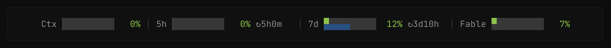
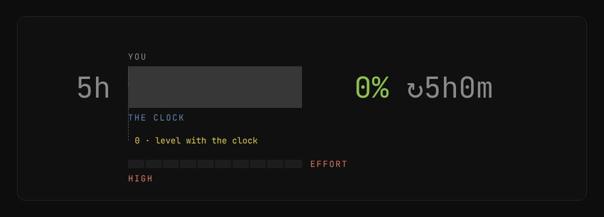
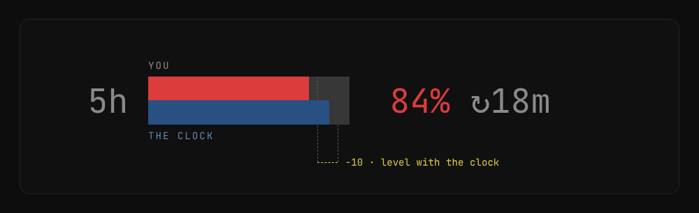
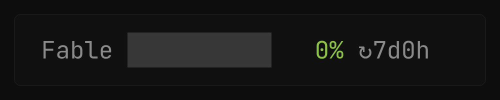

<div align="center">

# claude-statusline

## dir ⎇branch · ★ Model · Ctx · 5h · 7d · Fable — at a glance

[](https://github.com/alp82/claude-statusline)

[](https://claude.com/claude-code)
[](https://code.claude.com/docs/en/statusline.md)
[](#requirements)

<br>

One bash script. It shows your folder and branch, the active model, how full the
context window is, and how much of your 5-hour, 7-day and Fable limits you have
used — as bars, under the prompt, while you work.

<br>



**[See it in motion → alp82.github.io/claude-statusline](https://alp82.github.io/claude-statusline/)**

</div>

---

## Install

Paste this into Claude Code. It installs the script, wires Claude Code up to it,
and checks the result.

```text
Install the statusline from https://github.com/alp82/claude-statusline for me.
Run: curl -fsSL https://alp82.github.io/claude-statusline/install.sh | bash
Then check that bash, jq and curl are present, confirm ~/.claude/settings.json
points statusLine at ~/.claude/statusline.sh, and tell me what to do next.
```

Claude reads the installer before it runs it, tells you what changed, and fixes
anything missing. Re-paste it any time to upgrade.

<details>
<summary>Or run the installer yourself</summary>

<br>

Same script, no agent in the middle:

```sh
curl -fsSL https://alp82.github.io/claude-statusline/install.sh | bash
```

That drops `statusline.sh` into `~/.claude/`, makes it executable, and points
`settings.json` at it. Anything it replaces is copied to `<file>.bak` first —
your own `statusline.sh`, a symlink to a clone, an existing `settings.json`.
Re-run it any time to upgrade. `--no-settings` installs the script only
(`… | bash -s -- --no-settings`); `--help` has the rest.

</details>

<details>
<summary>Or install it by hand</summary>

<br>

One file, nothing else:

```sh
curl -fsSL https://raw.githubusercontent.com/alp82/claude-statusline/main/statusline.sh \
  -o ~/.claude/statusline.sh
chmod +x ~/.claude/statusline.sh
```

Then point Claude Code at it yourself, in `~/.claude/settings.json`:

```json
{
  "statusLine": {
    "type": "command",
    "command": "~/.claude/statusline.sh"
  }
}
```

</details>

## Uninstall

The same prompt in reverse:

```text
Uninstall the statusline from https://github.com/alp82/claude-statusline for me.
Run: curl -fsSL https://alp82.github.io/claude-statusline/install.sh | bash -s -- --uninstall
Then confirm ~/.claude/statusline.sh is gone and ~/.claude/settings.json no longer
has a statusLine entry, and show me which .bak files it left behind.
```

<details>
<summary>Or run it yourself</summary>

<br>

```sh
curl -fsSL https://alp82.github.io/claude-statusline/install.sh | bash -s -- --uninstall
```

Deletes `~/.claude/statusline.sh`, drops the `statusLine` entry from
`settings.json` and clears the cached usage numbers under `~/.claude/cache/` —
backing up the script and `settings.json` as `.bak` first. Everything else in
`settings.json` is left as it was, and if `statusLine` points at some other
statusline it is left alone. `--no-settings` removes the script only.

</details>

## What it shows

Left to right:

- **dir ⎇ branch** — the current directory's name, and the git branch you are on
- **★ Model** — the active model's display name
- **Ctx** — how full the context window is, 0–100%
- **5h / 7d** — your 5-hour and 7-day rate-limit windows: how much you have used,
  how much of the window has gone by, and `↻` the time until it resets
- **Fable** — the same, for Fable's own weekly quota

## How to read it

### Usage against time



The top half of each cell is how much of the window you have used. The bottom
half is how much of the window has gone by. If the top reaches further right
than the bottom, you are using it faster than the clock, and you will run out
before it resets.

Colour follows usage: green under 50%, yellow 50–80%, red above 80%.

### Context window


Turns yellow at 25% and red at 50% — sooner than the limit bars, because a full
context window stops you working right away. The bar fills in eighths of a
character, so it moves before the number does.

### When a window resets



At the end of a 5-hour window both halves drop back to zero, the colour goes
back to green, and the countdown starts again at 5h0m.

### The Fable window



Claude Code does not send this one. The script reads it from `~/.claude.json`
and only asks the API for a fresh value in the background, at most every ten
minutes — so it stays out of the TUI's way.

## Requirements

- `bash`
- [`jq`](https://jqlang.github.io/jq/) — parses the statusline JSON from stdin
- `curl` — only for refreshing the Fable weekly quota

## How it works

Claude Code pipes a JSON blob to the script on stdin
([docs](https://code.claude.com/docs/en/statusline.md)). Everything but the
Fable window comes straight from that payload. The Fable weekly quota isn't in
it, so the script reads the CLI's own cached copy from `~/.claude.json` and only
hits `/api/oauth/usage` itself — in the background, throttled — when that copy
is stale.

## License

MIT
